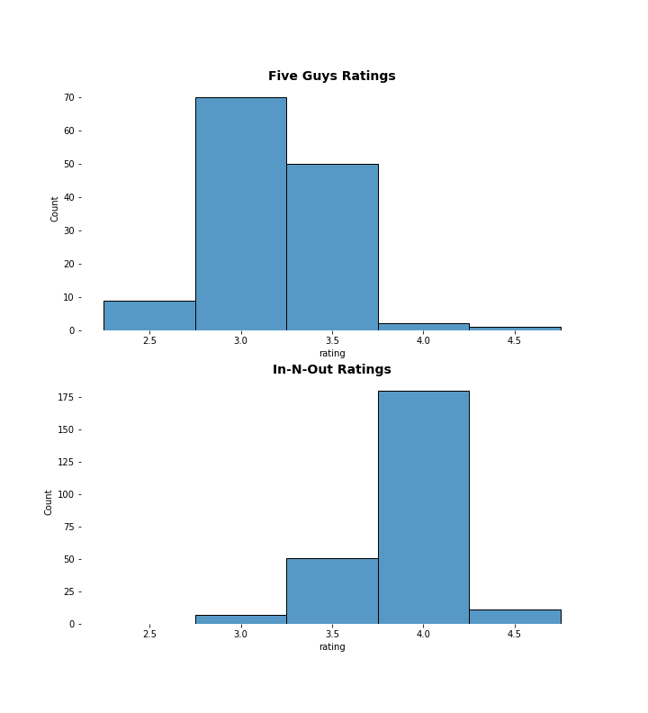

# Using the Yelp API: Five Guys vs. In-N-Out

This repository goes with a blog post that gives an intro to using the Yelp API.  I read an article that ranked best loved burgers in the U.S. and I felt that it did not do justice to In-N-Out, which is not available in every state.  I wanted to compare Yelp ratings between Five Guys and In-N-Out in California, a state where they are both present to see if it differed.

Below are my findings. In-N-Out was rated significantly higher in California! Below you can see the distribution of ratings. Very few of the Five Guys received any ratings above 3.5. There were also over 50 more reviews per In-N-Out restaurant on average! So it was more highly rated and more popular. This is hardly surprising given that the chain was founded in California in 1948 and Five Guys has only been in the state for a little over a decade.

